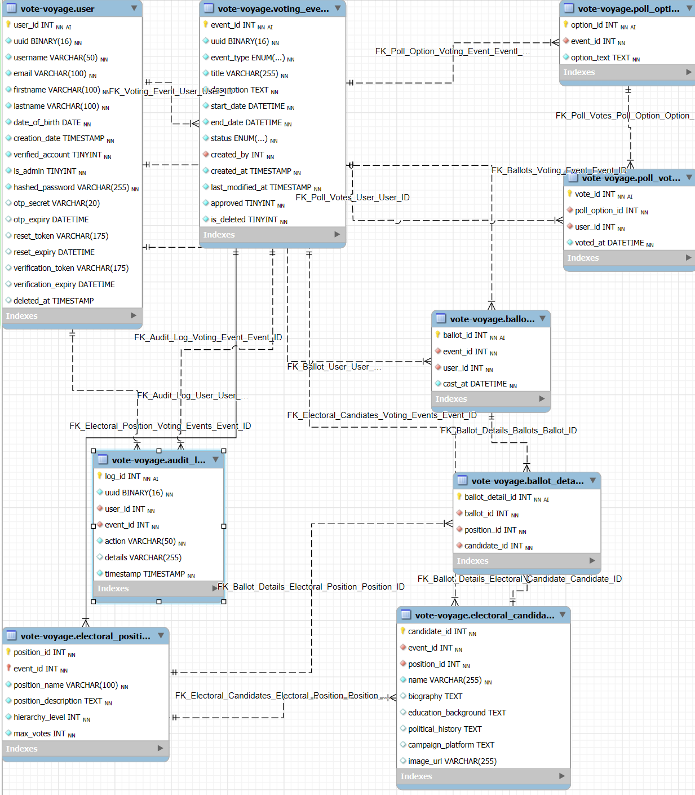

# Online Voting System

## INTRODUCTION

In an age where technology seamlessly integrates into our daily lives, the way we participate in democracy is evolving. Recent discussions highlight that electronic voting systems have gained traction as a means to enhance civic engagement and streamline the democratic process (Smith & Clark, 2005). The Online Voting System is designed to empower citizens, making the voting process more accessible, secure, and efficient. Imagine a world where casting your vote is as simple as clicking a button from the comfort of your home while still ensuring the integrity and confidentiality of your choices.

These systems leverage cutting-edge technology to streamline voting, enhance accuracy, and improve accessibility for all citizens. One of the primary advantages of electronic voting systems is the significant improvement in efficiency compared to traditional paper-based methods, as they eliminate the time-consuming manual counting of ballots and simplify election logistics, saving time and resources. This serves as a comprehensive guide to our Online Voting System, detailing its features, functionalities, and the underlying technology that makes it all possible. Our goal is to break down barriers to participation, ensuring that every eligible voter can easily engage in the democratic process, regardless of their location or circumstances. The convenience of e-voting offers a potential solution to declining voter turnout by allowing individuals to vote without the constraints of traditional polling locations and hours, thus fostering greater participation in elections.

As we navigate through the complexities of this system, we invite you to explore the thoughtful design and robust security measures that have been put in place. From user-friendly interfaces to advanced encryption protocols, every aspect of the Online Voting System has been crafted with the voter in mind. Research indicates that while the convenience of online voting is undeniable, it is crucial to balance this with security and reliability concerns. The integrity of elections must remain paramount, as vulnerabilities in online systems could undermine public confidence in the electoral process. Therefore, developing secure and trustworthy online voting systems is essential to ensuring that the democratic process remains robust and effective in the digital age.
This overview underscores the importance of embracing technological advancements in voting while remaining vigilant about the challenges they present, ensuring that our democratic practices evolve in a manner that is both innovative and secure.

## Project Features and Characteristics

1. Accessible User Interface
2. User Authentication
3. Detailed Information about the Candidate
4. Secure Authentication and Identity Verification
5. Ballot Secrecy and Privacy
6. Real-Time Vote Tracking and Monitoring
7. Automatic Vote Counting and Result Generation
8. Auditability and Transparency
9. Data Protection and Compliance

## Project Scope

The Online Voting System project aims to bring modern technology, ensuring that voting is secure and efficient for all eligible voters. Emphasizing the need for scalability, security, and performance optimization, the integration of diverse technologies and protocols must be orchestrated with precision to create a robust and user-friendly online voting platform.
The Online Voting System project aims to bring modern technology, ensuring that voting is secure and efficient for all eligible voters. Emphasizing the need for scalability, security, and performance optimization, the integration of diverse technologies and protocols must be orchestrated with precision to create a robust and user-friendly online voting platform.

The online voting system's architecture must be enough to handle high volumes of traffic during peak periods, ensuring that each vote is accurately recorded and securely stored. Stakeholders can ensure maximum voter participation, while also safeguarding the integrity and confidentiality of the voting process. This entails the meticulous planning and implementation of data encryption, authentication mechanisms, and failover systems to prevent any potential disruptions or security breaches. By adhering to best practices in system integration and architecture, the online voting system can significantly enhance the democratic process by providing a convenient, accessible, and transparent platform for citizens to exercise their right to vote.

## Work Breakdown Structure

| Phase                      | Task                                                      | Description                                                                          |
| -------------------------- | --------------------------------------------------------- | ------------------------------------------------------------------------------------ |
| **1. Project Initiation**  | Define project scope                                      | Clearly outline what the project will achieve and its boundaries.                    |
|                            | Identify stakeholders                                     | Determine who will be affected by or have an interest in the project.                |
|                            | Develop project charter                                   | Create a formal document that authorizes the project.                                |
|                            | Conduct feasibility study                                 | Assess if the project is technically, financially, and operationally viable.         |
| **2. Planning Phase**      | Create project plan                                       | Develop a comprehensive plan including timelines, resources, and deliverables.       |
|                            | Define objectives and deliverables                        | Specify project goals and tangible outputs.                                          |
|                            | Set timelines and milestones                              | Establish key dates for deliverables and checkpoints.                                |
|                            | Allocate resources                                        | Determine the necessary resources (people, technology, budget).                      |
|                            | Risk assessment                                           | Identify potential risks that could impact the project.                              |
|                            | Identify potential risks                                  | List challenges (e.g., security breaches, technical failures).                       |
|                            | Develop mitigation strategies                             | Create plans to minimize or address identified risks.                                |
| **3. System Design**       | Architectural design                                      | Define how components will interact.                                                 |
|                            | Define system architecture                                | Outline the technical structure (e.g., client-server model).                         |
|                            | Plan for scalability and performance optimization         | Ensure the system can handle high traffic during peak periods.                       |
|                            | User interface design                                     | Create visual layouts and workflows for user interaction.                            |
|                            | Develop wireframes and prototypes                         | Visualize user interactions before development.                                      |
|                            | Ensure accessibility features                             | Design interfaces usable by individuals with disabilities.                           |
| **4. Content Development** | Accessible User Interface                                 | Ensure the interface is easy to navigate for all users.                              |
|                            | User Authentication                                       | Implement secure login processes to verify voter identity.                           |
|                            | Responsive Application                                    | Ensure functionality across desktop and mobile devices.                              |
|                            | Detailed Information about the Candidate                  | Provide voters with information about candidates.                                    |
|                            | Secure Authentication and Identity Verification           | Confirm voter identities securely.                                                   |
|                            | Ballot Secrecy and Privacy                                | Ensure votes remain confidential.                                                    |
|                            | Real-Time Vote Tracking and Monitoring                    | Allow voters to track their vote status in real-time.                                |
|                            | Automatic Vote Counting and Result Generation             | Streamline the counting process for quick results.                                   |
|                            | Auditability and Transparency                             | Maintain logs for vote verification.                                                 |
|                            | Bi-Language Support                                       | Offer multiple language options.                                                     |
|                            | Data Protection and Compliance                            | Ensure adherence to legal data privacy standards.                                    |
| **5. Development Phase**   | Front-end development                                     | Implement a user-friendly interface and ensure responsive design.                    |
|                            | Back-end development                                      | Develop secure authentication, ballot secrecy, and real-time vote tracking features. |
|                            | Database setup                                            | Establish a secure database for storing voter information and records.               |
|                            | Design voter information database                         | Structure how voter data is stored securely.                                         |
|                            | Implement data protection measures                        | Use encryption to protect sensitive information.                                     |
| **6. Testing Phase**       | Unit testing                                              | Test individual components to ensure functionality.                                  |
|                            | Integration testing                                       | Ensure components work together seamlessly.                                          |
|                            | User acceptance testing (UAT)                             | Gather feedback from stakeholders and confirm system meets their needs.              |
| **7. Security Measures**   | Implement encryption protocols                            | Safeguard sensitive data through encryption.                                         |
|                            | Establish identity verification processes                 | Ensure only eligible voters can cast votes.                                          |
|                            | Conduct vulnerability assessments                         | Regularly test systems for weaknesses.                                               |
| **8. Deployment Phase**    | Prepare for deployment                                    | Finalize server setup and configurations for secure hosting.                         |
|                            | Launch online voting platform                             | Make the platform available to voters on election day.                               |
| **9. Post-Deployment**     | Monitor system performance and user feedback              | Continuously check system performance and gather user feedback.                      |
|                            | Address issues and bugs                                   | Resolve problems during voting or result reporting.                                  |
|                            | Conduct project retrospective                             | Review successes and areas for improvement.                                          |
| **10. Documentation**      | Create user manuals and guides                            | Develop clear instructions for voter registration, login, and voting process.        |
|                            | Document technical specifications and system architecture | Provide detailed descriptions of the system's technical structure.                   |
|                            | Compile a report on project outcomes                      | Summarize findings, successes, and challenges faced throughout the project.          |

## Functional Requirements

**Authentication**: Users can log in or logout to their respective accounts securely and swiftly.
**Different Vote Type**: Users can create a different type of voting i.e.,—poll type, electoral type, etc.
**Visualize Tally Result**: Users are able to visualize the result of the poll or election.
**Multi-factor Authentication**: To further enhance the security of the user's account, users are required to enter the OTP that the system sends to the email they used to register.
**Data Management**: User are able to create, and delete votes.

## Non Functional Requirements

**Secure Authentication**: Using JSON Web Token, we leverage HTTP-based authentication tokens; these tokens are not accessible in JavaScript to reduce the XSS attack, thereby protecting user data and sessions from malicious actors.
**Usability**: The system allows users to complete the registration process within 5 minutes. Provided that they have an internet connection that is strong enough.
**Hashed Password**: For added security user's password are hashed and prepended with salt to prevent rainbow table attacks.

### User Requirements

| No. | Users              | System Features         | Requirements                                                           |
| --- | ------------------ | ----------------------- | ---------------------------------------------------------------------- |
| 1   | Voters             | User Registration       | Must provide identification information (e.g., ID, email)              |
|     |                    | Secure Login/Logout     | Implement multi-factor authentication for security                     |
|     |                    | Ballot Selection        | Provide intuitive interface for selecting candidates/options           |
|     |                    | Vote Confirmation       | Display confirmation message after vote is cast                        |
|     |                    | Voting Accessibility    | Compliance with accessibility standards to ensure all users can vote.  |
|     |                    | Anonymous Voting        | Ensure that votes are private and anonymous                            |
|     |                    | Vote Tracking           | Allow users to track their voting status (e.g., ballot submitted)      |
|     |                    | Help & Support          | FAQs, live chat, or tutorial videos for assistance                     |
|     |                    | User Profile Management | Offer the option to update personal information and preferences        |
|     |                    | Feedback Mechanism      | Collect user feedback on the voting experience                         |
| 2   | Administrators     | User Management         | Manage voter registrations and access rights                           |
|     |                    | Election Setup          | Define election parameters (dates, candidates, etc.)                   |
|     |                    | Vote Counting           | Automated and secure tallying of votes                                 |
|     |                    | Reporting               | Generate reports on voter turnout and election results                 |
|     |                    | Audit Trails            | Maintain logs of actions and changes made in the system                |
|     |                    | Security Management     | Monitor and manage system security protocols                           |
|     |                    | Issue Resolution        | Handle disputes or issues raised by voters                             |
|     |                    | System Maintenance      | Conduct regular updates and maintenance of the voting system           |
| 3   | Election Officials | Communication Tools     | Tools for announcing results and communicating with voters             |
|     |                    | Compliance Tracking     | Ensure adherence to election laws and regulations                      |
| 4   | Developers         | API Integration         | Allow integration with third-party services (e.g., payment processing) |
|     |                    | System Scalability      | Ensure system can handle increased loads during peak voting times      |
|     |                    | Security Features       | Implement encryption, firewalls, and data protection measures          |
|     |                    | User Interface Design   | Develop an intuitive and accessible UI for all user types              |
|     |                    | Documentation           | Provide comprehensive documentation for users and administrators       |

### Use case

## Database Architecture

### Data Dictionary

---

**Audit Logs Table**

-   **log_id**: A unique identifier for each audit log entry, automatically generated to keep the logs distinct.
-   **uuid**: A universally unique identifier (UUID) that serves as a secure reference for each log, preventing conflicts or duplication.
-   **user_id**: Links the audit log to the user who performed the action, with a foreign key reference to the "Users" table.
-   **event_id**: Links the audit log to the specific event that was logged, with a foreign key reference to the "Voting Events" table.
-   **action**: Describes the specific action that was taken on a vote, such as "vote cast" or "vote invalidated."
-   **details**: Provides additional information about the action, such as the user's IP address or the reason for invalidating a vote.
-   **timestamp**: Records the precise time when the action in the log occurred, providing accountability for any changes or events that took place.

---

**Users Table**

-   **user_id**: A unique identifier for each user in the system. It is the primary key and is automatically incremented to ensure uniqueness.
-   **uuid**: A universally unique identifier (UUID) that serves as a secure reference for each user, preventing conflicts or duplication.
-   **username**: The user's chosen name for login and identification purposes, ensuring uniqueness and security.
-   **email**: The user's email address, which is used for communication, notifications, and account verification.
-   **first_name** and **last_name**: The user's real first and last names, which are stored for identification and personalization.
-   **date_of_birth**: The user's birthdate, which is required for age verification and demographic analysis.
-   **account_creation_date**: The timestamp when the user's account was created, providing a record of account activity.
-   **verified_account**: A flag that indicates whether the user has verified their account (1 for yes, 0 for no).
-   **verification_token** and **verification_expiry**: These fields store the token sent to users for account verification and the deadline for using it.
-   **salt**: A random string added to the user's password before it is hashed to enhance security.
-   **hashed_password**: The user’s encrypted password, stored in a secure, hashed format.
-   **otp_secret** and **otp_expiry**: These columns store information for one-time passwords (OTPs), which are used for two-factor authentication. The secret generates the OTP, and the expiry dictates how long the OTP is valid.
-   **reset_token** and **reset_expiry**: These columns handle password reset functionality by storing tokens and their expiration times.
-   **verified_account**: A flag that indicates whether a user has verified their account (1 for yes, 0 for no).
-   **verification_token** and **verification_expiry**: These fields store the token sent to users for account verification and the deadline for using it.

---

**Voting Events Table**

-   **event_id**: A unique identifier for each voting event, automatically generated to ensure uniqueness.
-   **uuid**: A universally unique identifier (UUID) that serves as a secure reference for each voting event, preventing conflicts or duplication.
-   **event_type**: Indicates the type of voting event (e.g., poll or electoral), allowing for differentiation between different types of voting processes.
-   **title**: The title of the voting event, providing a brief description of the event for users.
-   **description**: A detailed description of the voting event, outlining the purpose, candidates, and other relevant information.
-   **start_date** and **end_date**: The start and end dates of the voting event, defining the period during which users can cast their votes.
-   **status**: Indicates the current status of the voting event (e.g., upcoming, active, completed, or canceled), providing real-time information on the event's progress.
-   **created_by**: Links the voting event to the user who created it, ensuring accountability and tracking of event creators.
-   **created_at** and **last_modified_at**: Timestamps that record when the event was created and last modified, providing a history of changes made to the event.
-   **approved**: A flag that indicates whether the voting event has been officially approved for execution (1 for yes, 0 for no).

---

**Poll Votes Table**

-   **poll_vote_id**: A unique identifier for each poll vote entry. It automatically increments to ensure distinction among votes.
-   **vote_id**: Links the poll vote to the specific vote cast in the system, with a foreign key reference to the "Votes" table.
-   **option_id**: Connects the poll vote to the selected option from the "Poll Options" table, allowing for tracking of individual selections.

---

**Electoral Votes Table**

-   **electoral_vote_id**: A unique identifier for each electoral vote entry. It automatically increments to distinguish between different votes.
-   **vote_id**: Links the electoral vote to the specific vote cast in the system, with a foreign key reference to the "Votes" table.
-   **candidate_id**: Links the electoral vote to the corresponding candidate in the system, ensuring clarity on whom the vote is for.
-   **vote_timestamp**: Captures the exact moment when the electoral vote was cast, providing transparency and enabling precise tracking of voting actions.

---

**Vote Types Table**

-   **vote_type_id**: A unique identifier for each type of vote, automatically generated for uniqueness.
-   **type_name**: This column indicates whether the vote is part of a "poll" or an "electoral" process, distinguishing between different types of voting scenarios.
-   **title**: This column shows the title for specific vote, be it electoral and poll type.

---

**Votes Table**

-   **vote_id**: A unique identifier for each vote cast in the system. It automatically increments for distinction.
-   **user_id**: Links the vote to the voter who cast it, with a foreign key reference to the "Users" table.
-   **vote_type_id**: Identifies the type of voting process (e.g., poll or electoral), linking back to the "Vote Types" table.
-   **candidate_id**: If the vote is for a candidate, this column links the vote to the corresponding candidate in the system.
-   **option_id**: If the vote is part of a poll, this column links to the selected option from the "Poll Options" table.
-   **vote_timestamp**: Captures the exact moment when the vote was cast, ensuring precise tracking and transparency.
-   **approved**: A flag that indicates whether the vote has been officially approved for inclusion in the final count (1 for yes, 0 for no).

### Database Tables

**Poll Votes**

**Users Table**

| Column Name             | Data Type      | Constraints                                 |
| ----------------------- | -------------- | ------------------------------------------- |
| `user_id`               | `int`          | `NOT NULL`, `AUTO_INCREMENT`, `PRIMARY KEY` |
| `uuid`                  | BINARY(16)     | `NOT NULL`, `UNIQUE`                        |
| `salt`                  | `VARCHAR(45)`  | `NOT NULL`                                  |
| `hashed_password`       | `VARCHAR(255)` | `NOT NULL`                                  |
| `otp_secret`            | `VARCHAR(20)`  | `DEFAULT NULL`                              |
| `otp_expiry`            | `DATETIME`     | `DEFAULT NULL`                              |
| `reset_token`           | `VARCHAR(175)` | `DEFAULT NULL`                              |
| `reset_expiry`          | `DATETIME`     | `DEFAULT NULL`                              |
| `verified_account`      | `TINYINT`      | `NOT NULL DEFAULT '0'`                      |
| `verification_token`    | `VARCHAR(175)` | `DEFAULT NULL`                              |
| `verification_expiry`   | `DATETIME`     | `DEFAULT NULL`                              |
| `username`              | `VARCHAR(45)`  | `NOT NULL`                                  |
| `email`                 | `VARCHAR(100)` | `NOT NULL`                                  |
| `first_name`            | `VARCHAR(100)` | `NOT NULL`                                  |
| `last_name`             | `VARCHAR(100)` | `NOT NULL`                                  |
| `date_of_birth`         | `date`         | `NOT NULL`                                  |
| `account_creation_date` | `DATETIME`     | `NOT NULL DEFAULT CURRENT_TIMESTAMP`        |

| **Indexes** | **Description** |        |
| ----------- | --------------- | ------ |
| `PRIMARY`   | (`user_id`)     |        |
| `uuid`      | (`uuid`)        | UNIQUE |
| `username`  | (`username`)    | UNIQUE |

---

**Voting Events**

| Column Name        | Data Type                                              | Constraints                                                      |
| ------------------ | ------------------------------------------------------ | ---------------------------------------------------------------- |
| `event_id`         | `int`                                                  | `NOT NULL`, `AUTO_INCREMENT`, `PRIMARY KEY`                      |
| `uuid`             | `BINARY(16)`                                           | `NOT NULL`, `UNIQUE`                                             |
| `event_type`       | `ENUM('poll','electoral')`                             | `NOT NULL`                                                       |
| `title`            | `VARCHAR(255)`                                         | `NOT NULL`                                                       |
| `description`      | `text`                                                 | `NOT NULL`                                                       |
| `start_date`       | `DATIMETIME`                                           | `NOT NULL`                                                       |
| `end_date`         | `DATIMETIME`                                           | `NOT NULL`                                                       |
| `status`           | `ENUM('upcoming', 'active', 'completed', 'cancelled')` | `NOT NULL`                                                       |
| `created_by`       | `int`                                                  | `NOT NULL`, `FOREIGN KEY`                                        |
| `created_at`       | `TIMESTAMP`                                            | `NOT NULL DEFAULT CURRENT_TIMESTAMP`                             |
| `last_modified_at` | `TIMESTAMP`                                            | `NOT NULL DEFAULT CURRENT_TIMESTAMP ON UPDATE CURRENT_TIMESTAMP` |
| `approved`         | `TINYINT`                                              | `NOT NULL DEFAULT '0'`                                           |

| **Indexes**                         | **Description** |                                                                                  |
| ----------------------------------- | --------------- | -------------------------------------------------------------------------------- |
| `PRIMARY`                           | (`event_id`)    |                                                                                  |
| `uuid`                              | (`uuid`)        | `UNIQUE`                                                                         |
| `FK_Voting_Events_Users_Created_By` | (`created_by`)  | `FOREIGN KEY` REFERENCES `users` (`user_id`) ON DELETE CASCADE ON UPDATE CASCADE |

---

**Poll Options**

| Column Name   | Data Type | Constraints                                 |
| ------------- | --------- | ------------------------------------------- |
| `option_id`   | `int`     | `NOT NULL`, `AUTO_INCREMENT`, `PRIMARY KEY` |
| `event_id`    | `int`     | `NOT NULL`, `KEY event_id`, `FOREIGN KEY`   |
| `option_text` | `TEXT`    | `NOT NULL`                                  |

| **Indexes**                              | **Description**                            |                                                                                           |
| ---------------------------------------- | ------------------------------------------ | ----------------------------------------------------------------------------------------- |
| `PRIMARY`                                | (`option_id`)                              |                                                                                           |
| `FK_Poll_Options_Voting_Events_Event_ID` | (`FK_Poll_Options_Voting_Events_Event_ID`) | `FOREIGN KEY` REFERENCES `voting_events` (`event_id`) ON DELETE CASCADE ON UPDATE CASCADE |

---

**Audit Logs Table**

| Column Name | Data Type     | Constraints                                 |
| ----------- | ------------- | ------------------------------------------- |
| `log_id`    | `INT`         | `NOT NULL`, `AUTO_INCREMENT`, `PRIMARY KEY` |
| `uuid`      | `BINARY(16)`  | `NOT NULL`, `UNIQUE`                        |
| `user_id`   | `INT`         | `NOT NULL`, `KEY user_id`, `FOREIGN KEY`    |
| `event_id`  | `INT`         | `NOT NULL`, `KEY event_id`, `FOREIGN KEY`   |
| `action`    | `VARCHAR(50)` | `NOT NULL`                                  |
| `details`   | `text`        | `NOT NULL`                                  |
| `timestamp` | `DATETIME`    | `NOT NULL DEFAULT CURRENT_TIMESTAMP`        |

| **Indexes**                            | **Description**                          |                                                                                           |
| -------------------------------------- | ---------------------------------------- | ----------------------------------------------------------------------------------------- |
| `PRIMARY`                              | (`log_id`)                               |                                                                                           |
| `uuid`                                 | (`uuid`)                                 | `UNIQUE`                                                                                  |
| `FK_Audit_Logs_Users_User_ID`          | (`FK_Audit_Logs_Users_User_ID`)          | `FOREIGN KEY` REFERENCES `users` (`user_id`) ON DELETE CASCADE ON UPDATE CASCADE          |
| `FK_Audit_Logs_Voting_Events_Event_ID` | (`FK_Audit_Logs_Voting_Events_Event_ID`) | `FOREIGN KEY` REFERENCES `voting_events` (`event_id`) ON DELETE CASCADE ON UPDATE CASCADE |

---

**Votes Table**

| Column Name      | Data Type  | Constraints                                   |
| ---------------- | ---------- | --------------------------------------------- |
| `vote_id`        | `INT`      | `NOT NULL`, `AUTO_INCREMENT`, `PRIMARY KEY`   |
| `user_id`        | `INT`      | `NOT NULL`, `KEY user_id`, `FOREIGN KEY`      |
| `vote_type_id`   | `INT`      | `NOT NULL`, `KEY vote_type_id`, `FOREIGN KEY` |
| `vote_timestamp` | `DATETIME` | `NOT NULL DEFAULT CURRENT_TIMESTAMP`          |
| `approved`       | `tinyint`  | `NOT NULL DEFAULT '0'`                        |

| **Indexes**                        | **Description**                      |                                                                                            |
| ---------------------------------- | ------------------------------------ | ------------------------------------------------------------------------------------------ |
| `PRIMARY`                          | (`vote_id`)                          |                                                                                            |
| `FK_Votes_Users_User_ID`           | (`FK_Votes_Users_User_ID`)           | `FOREIGN KEY` REFERENCES `users` (`user_id`) ON DELETE CASCADE ON UPDATE CASCADE           |
| `FK_Votes_Vote_Types_Vote_Type_ID` | (`FK_Votes_Vote_Types_Vote_Type_ID`) | `FOREIGN KEY` REFERENCES `vote_types` (`vote_type_id`) ON DELETE CASCADE ON UPDATE CASCADE |

## ERD

### Functional Testing Summary

### Evaluation Procedure

### Recommendation
